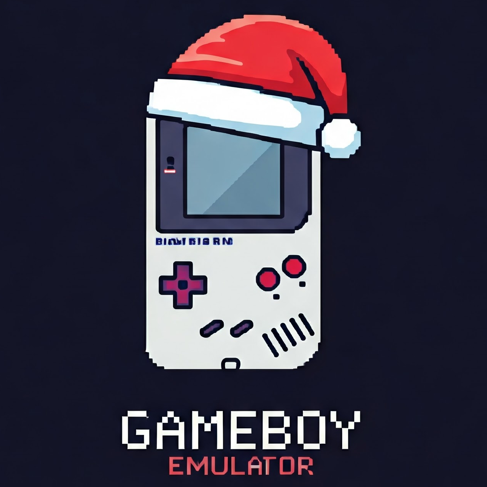

# Gameboy Emulator

## About
A project started over Christmas 2024 to build a Gameboy emulator from scratch as learning project only. It definitely won't be fast or accurate.

For performance reasons I have not tested this using the standard CPython, only been run currently in PyPy 3.10.14 64-bit. 

## Project Aims
 * Run Simple/ Non-Memory Mapped Catridges (32KB)
    * Dr. Mario
    * Tetris

## Progress

|Unit| State|Comment
|---|-|-|
|CPU|90% Opcodes Implemented 88% CB Prefixed Opcodes Implemented|All Blargg Tests Failing
|Sound|Not Implemented|Get CPU working correctly first|
|PPU (GPU)|Basic Implementation|Background layer doesn't support scaling, sprites do not support flipping, sprites don't respect pixel mixing or priority|
Memory Banks| Not Supported| Get simple games running first.
Joypad|Implemented with limitations|Only one key press event can be registered at once|
